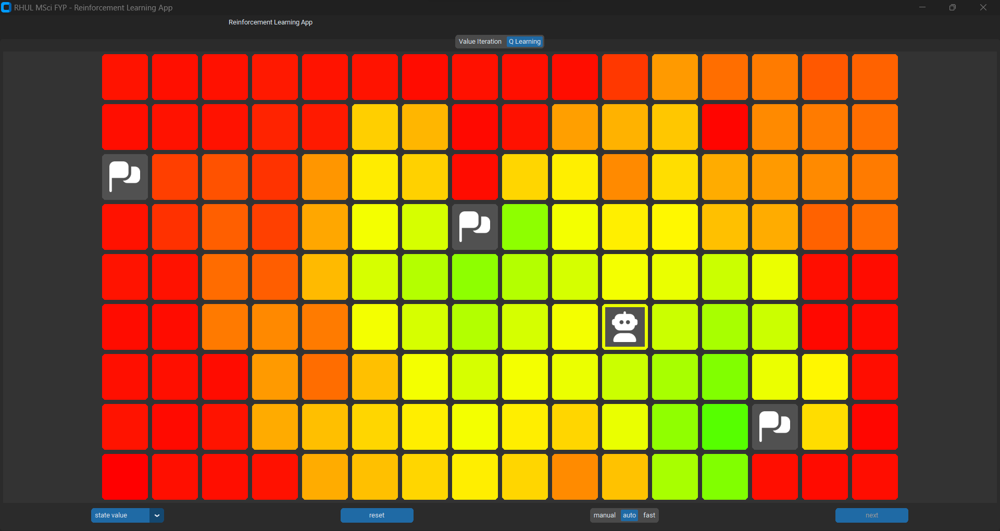
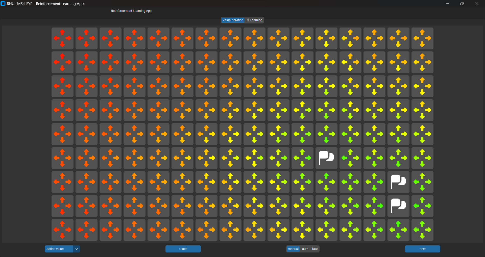

<!-- omit in toc -->
# Reinforcement Learning App

This application implements reinforcement learning agents in a grid world. 




<!-- omit in toc -->
## Table Of Contents
- [Running the Program](#running-the-program)
- [Project Structure](#project-structure)
- [Documentation](#documentation)
- [Development](#development)
  - [Poetry](#poetry)
  - [Code quality tooling](#code-quality-tooling)
  - [Tips](#tips)

## Running the Program

> Note: This guide is for those only interested in using the application, see [Development](#development) for a development workflow.

This project requires Python 3.10 and with Tkinter. Most distributions of Python include tkinter although it may need to be enabled in the installer. Python installers can be found [here](https://www.python.org/downloads/).

> If you encounter issues or don't want to install this program locally there is a docker file [here](../.devcontainer/Dockerfile). This docker file specifies the environment and all the tooling for this project.

You can install and run the project with a Python package manager such as `pipx` or `poetry`. we will be using `pipx` here because of its simplicity. There is a guide [here](https://pypa.github.io/pipx/installation/) on how you can install `pipx`.

once `pipx` is installed open your terminal and navigate to this folder (`code`) and run this command to start the program 

```Bash
python3 -m pipx run --spec . start
```

## Project Structure

the project is mostly hierarchical with related features being located in the same or nearby folders (packages). the root folder `code` contains all the meta configuration for this project, this includes
 - `pyproject.toml`: which specifies what dependencies the program needs. the entry points and other tooling configurations.
 - `setup.cfg`: contains the configuration for tools that have not migrated to the PEP 518  (`pyproject.toml`) standard yet
 - `.pre-commit-config`: specifies what should be run before a commit is allowed.
 - `.gitignore`: excludes certain files from being added to the git repository.

the `code` folder contains two more important folders `src` and `tests`. tests contains all the tests and the related mocks necessary, code in the tests package is not used at runtime.

`src` folder contains everything necessary at runtime, these are in four main parts:
 - `model`: where all of the state and learning functionality is stored
 - `view`: where all of the GUI code for visualizing the reinforcement learning is stored
 - `controller`: the code that updates the model with the user's input, this is the code that unites the model and view.
 - `entry points`: this is where execution starts. There are two, the main entry point and one for profiling the code.


`src` is mostly code however it also includes the application's config [`src/config.toml`](./src/config.toml) and the icon files used by the program. This [`src/config.toml`](./src/config.toml) is where important configuration options for the application are determined such as the size of the grid world. The icons are from Flaticon and require the following attribution:

UIcons by [Flaticon](https://www.flaticon.com/uicons)

## Documentation

Documentation is written alongside the code with doc-strings, in the Google docstring format. This can be built into a complete documentation site. a package called `mkdocs` has been configured for building this site.

The last build of the docs is at `code/docs` you can open these files directly or run one of the following commands to start a local server then open [http://localhost:3000](http://localhost:3000) in your browser to view the documentation.

To start a local server of the last build you can run.
```Bash
python3 -m http.server --directory docs 3000
```
Alternatively use the following command to get the latest docs as a local server.
```Bash 
poetry run mkdocs serve -a localhost:3000
```

## Development


To develop on this project I recommend using [Visual Studio Code](https://code.visualstudio.com/download) and the provided [development container](https://code.visualstudio.com/docs/devcontainers/containers). using VS Code and this development container standardises the environment and avoids device-specific issues and this repository is configured for a VS Code workflow.

If not using VS Code, the required tools are:
 - Python 3.10, including:
   - Virtual environments (`venv`)
   - `tkinter`/ Tcl
   - `pip`
 - `poetry`
 - `pre-commit`

### Poetry

Poetry is a Python package manager and it manages the Python retirements of this project. 

When you first start you will need to run the following command to install the dependencies
```Bash
poetry install
```

you will also need to run the following command, to ensure each commit meets the linting requirements:
```Bash
poetry run pre-commit install
```

To run the project run:

```Bash
poetry run start
```

### Code quality tooling

To avoid bugs and enforce consistency this project has a number of tools. these tools are configured with `pre-commit` to run together before each commit, all tools must pass before a commit can be pushed. 

the tools are:
 | Tool     | Description                                    | command                   |
 | -------- | ---------------------------------------------- | ------------------------- |
 | `black`  | Formats the code in a consistent way.          | `poetry run black src`    |
 | `pytest` | Ensures all tests are passing.                 | `poetry run pytest --cov` |
 | `flake8` | Lints the code, ensure that it meets standard. | `poetry run flake8`       |
 | `mypy`   | Ensures all static types are correct.          | `poetry run mypy`         |


they can be all run together with:
```Bash
pre-commit run --all-files
```


### Tips 

[we make python](https://readthedocs.org/projects/wemake-python-styleguide/) is the style guide that this project follows have a look at the [docs here](https://wemake-python-styleguide.readthedocs.io/en/latest/) for an explanation of their rules, some I have found to be contradictory with other tooling or excessively restrictive so I have disabled them

if the code needs formatting then in the first pass of pre-commit it will update the code but it will fail the test because it needed to be updated, re-run pre-commit/ try committing again and it will often succeed